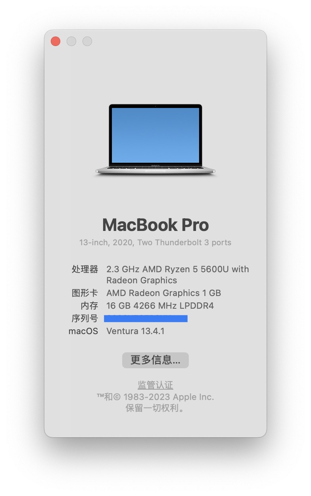

# Hackintosh for Thinkpad X13 Gen 2 Ryzen 5600U
[](https://www.apple.com/macos/ventura/)
[](https://github.com/acidanthera/OpenCorePkg)



## ⚙️ 硬件规格

[产品规格](https://www.lap4worx.de/media/pdf/dd/a6/cd/Lenovo-ThinkPad-X13-Gen-2-AMD-Spezifikationen.pdf)

| 类别 | 型号                                                         |
| ---- | ------------------------------------------------------------ |
| CPU  | AMD 5600U                                                    |
| GPU  | AMD Radeon 7 Graphics (Renoir)                               |
| 网卡 | 博通 BCM94360Z3（[驱动参考](https://blog.daliansky.net/BCM94360Z4-m.2-NGFF-interface-four-antenna-notebook_small-host-dedicated-black-Apple-wireless-network-card-driver-tutorial.html)） |
| 硬盘 | 忆联 AM630                                                   |

## 🚀 功能情况

| Category    | Status                 |
| ----------- | ---------------------- |
| 核显        | ✅ **但不支持硬件加速** |
| WiFi        | ✅                      |
| 蓝牙        | ✅                      |
| 扬声器      | ✅                      |
| 麦克风      | ❌                      |
| 摄像头      | ❌                      |
| Fn 功能     | ✅ 亮度、音量调节支持   |
| USB、Type-C | ✅ 支持供电、外接显示器 |
| 睡眠        | ⚠️ 未测试               |
| HDMI        | ⚠️ 未测试               |

## 🔧 需要自己生成的

### UTBMap

- 定制 USB 端口
- [官方仓库](https://github.com/USBToolBox/tool/)
- 操作指引：[文档](https://apple.sqlsec.com/6-%E5%AE%9E%E7%94%A8%E5%A7%BF%E5%8A%BF/6-1/)

### SSDTTime

- 生成 ACPI
- [官方仓库](https://github.com/corpnewt/SSDTTime)
- 操作指引：[视频](https://www.bilibili.com/video/BV1iN41167Jk)

### SSDT-SBUS-MCHC

- 可能不是必须，如果第一次 boot installer 时出错可以尝试这块内容

- 操作指引：[文档](https://dortania.github.io/Getting-Started-With-ACPI/Universal/smbus.html)

## 🛸 注意事项

### AMD_Vanilla Patch

- [官方仓库](https://github.com/AMD-OSX/AMD_Vanilla)
- 5600U 为 6 核心 CPU，如果为其他 CPU 参考本 EFI，需要根据官方仓库的 README，或是[参考视频](https://www.bilibili.com/video/BV1Vh4y1375g)中的说明，根据核心数修改 Patch 的数值

### 硬件加速

- 截止目前所使用的 [NootedRed](https://github.com/NootInc/NootedRed/actions/runs/5425999871) 版本（CI\#957）还未支持硬件加速
- Chrome、VS Code 都需要关闭硬件加速的设置
- 视频播放可以使用 Safari

### BIOS 设置

- 关闭 Secure Boot
- 设置显存大小：Config → Display → UMA Frame buffer Size（大小参见 NootedRed）

### 安装过程

- 安装时，可以先勾掉（disable）NootedRed 核显驱动，等成功安装后再启用，再重启

### 声卡驱动

- 制作 EFI 时可以先不考虑
- 成功安装后，使用 Hackintool 找到对应 PCI 路径，参考[视频](https://www.bilibili.com/video/BV1Qs4y1y7Df)启动声卡

### 触控板驱动

- 使用 VoodooI2C 和 VoodooPS2
- Visual 老哥给 [VoodooI2C](https://github.com/VoodooI2C/VoodooI2C) 支持 AMD 的 [commit](https://github.com/VoodooI2C/VoodooI2C/pull/530) 已经合并
- 但是截至目前为止（VoodooI2C v2.8）还没打包这次提交，所以本 EFI 中使用的 VoodooI2C 为非官方构建的版本（参见 VoodooI2C-NootIncBuild 目录下）

### Fn 键触发

- 目前 Fn 键配合 Fn 区按键正常使用：Fn + F12、亮度调节、音量调节
- 但单独按下 Fn 键，无法触发功能（如：按下时「显示符号与表情」，但可以使用 Cmd + Ctrl + Space 的快捷键替代）

## 🔫 TroubleShooting

### 卡在 `[EB|#LOG:EXITBS:START]`

- 参考[文档](https://dortania.github.io/OpenCore-Install-Guide/troubleshooting/extended/kernel-issues.html#stuck-on-eb-log-exitbs-start)

- 参考[改动](https://github.com/izumiiAoba/hackintosh-thinkpad-x13-gen2/commit/d7a52d2275384f1f1700b0de3786005713dbd5a5)

  ```rust
  Booter -> Quirks:
    DevirtualiseMmio -> false
    MmioWhitelist -> empty array
    EnableWriteUnprotector -> true
    RebuildAppleMemoryMap -> false
    SyncRuntimePermissions -> false
  ```

### 卡在 `In Memory Panic Stackshot Succeeded`

- `boot-args` 有问题（[参考](https://www.reddit.com/r/hackintosh/comments/11uihfy/comment/jcodplm/?utm_source=share&utm_medium=web2x&context=3)）

## 🌹 致谢与参考

- [国光的黑苹果安装教程：手把手教你配置 OpenCore](https://apple.sqlsec.com/)
- [AMD·黑苹果通用步骤教程：EFI制作流程](https://www.bilibili.com/video/BV1Vh4y1375g)
- [Dortania's OpenCore Install Guide](https://dortania.github.io/OpenCore-Install-Guide/)
- [OpenCore Little Translated](https://github.com/5T33Z0/OC-Little-Translated)
- [NootInc/NootedRed](https://github.com/NootInc/NootedRed)
- [黑果小兵的部落阁](https://blog.daliansky.net/)
