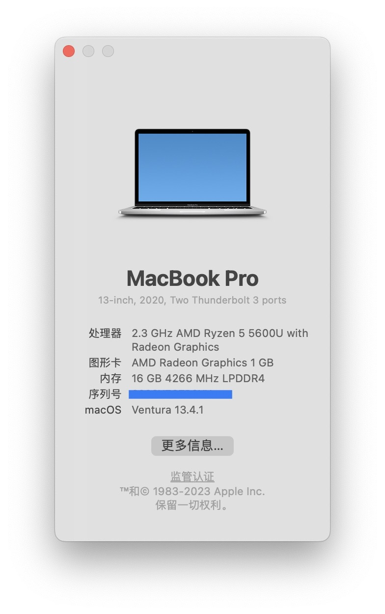

# Hackintosh EFI for ThinkPad X13 Gen 2 Ryzen 5600U
[](https://www.apple.com/macos/ventura/)
[](https://github.com/acidanthera/OpenCorePkg)
[](../README.md)



## ⚙️ Device Hardware

[Product Specifications Reference](https://www.lap4worx.de/media/pdf/dd/a6/cd/Lenovo-ThinkPad-X13-Gen-2-AMD-Spezifikationen.pdf)

| Category     | Model                                                        |
| ------------ | ------------------------------------------------------------ |
| CPU          | AMD 5600U                                                    |
| GPU          | AMD Radeon 7 Graphics (Renoir)                               |
| Network Card | Broadcom BCM94360Z3（[driver ref](https://blog.daliansky.net/BCM94360Z4-m.2-NGFF-interface-four-antenna-notebook_small-host-dedicated-black-Apple-wireless-network-card-driver-tutorial.html)） |
| M.2 SSD      | Union Memory AM630                                           |

## 🚀 Hardware Compatibility

| Category    | Status                                        |
| ----------- | --------------------------------------------- |
| iGPU        | ✅ **still not support hardware acceleration** |
| WiFi        | ✅                                             |
| Bluetooth   | ✅                                             |
| Speaker     | ✅                                             |
| Microphone  | ❌                                             |
| Camera      | ❌                                             |
| Fn Keys     | ✅ support brightness, volume control          |
| USB、Type-C | ✅ support power charge, external monitor      |
| Sleep       | ✅ S0                                          |
| HDMI        | ⚠️ not test                                    |

## 🔧 generate by yourself

### UTBMap

- make USB mapping
- [repo](https://github.com/USBToolBox/tool/)
- guide：[doc](https://apple.sqlsec.com/6-%E5%AE%9E%E7%94%A8%E5%A7%BF%E5%8A%BF/6-1/)

### SSDTTime

- create SSDTs
- [repo](https://github.com/corpnewt/SSDTTime)
- guide：[video](https://www.bilibili.com/video/BV1iN41167Jk)

### SSDT-SBUS-MCHC

- maybet not necessary，try this SSDT if stuck at first time boot installer

- guide：[doc](https://dortania.github.io/Getting-Started-With-ACPI/Universal/smbus.html)

## 🛸 Miscellaneous

### AMD_Vanilla Patch

- [repo](https://github.com/AMD-OSX/AMD_Vanilla)
- 5600U is 6 core CPU, modify Patch value if core count isn't the same, check more guide in [repo](https://github.com/AMD-OSX/AMD_Vanilla)

### Hardware Acceleration

- [NootedRed](https://github.com/NootInc/NootedRed/actions/runs/5425999871)(CI\#957) using in this EFI, hasn't support hardware acceleration by far
- disable all settings about hardware acceleration for Chrome, VS Code ([ref](https://nootinc.github.io/nred#chrome-chromium-based-browsers-and-apps-like-sublime-text-cause-graphical-artefacts-amongst-other-problems))
- use Safari for video playing

### BIOS Setting

- turn off Secure Boot
- setting VRAM：Config → Display → UMA Frame buffer Size (VRAM size refer to [NootedRed](https://nootinc.github.io/nred))

### Install Process

- disable NootedRed kext temporarily during boot installer
- enable after install successfully, and reboot again, then iGPU should work

### Drive Audio

- put this section aside before successfully install
- find Audio PCI path through Hackintool，check this [doc](https://dortania.github.io/OpenCore-Post-Install/universal/audio.html) for more guide

### Drive Trackpad

- use VoodooI2C and VoodooPS2
- [commit](https://github.com/VoodooI2C/VoodooI2C/pull/530) for supporting AMD in [VoodooI2C](https://github.com/VoodooI2C/VoodooI2C) has been merged, thanks Visual's work
- since VoodooI2C v2.8 hasn't release build which includes above commit, VoodooI2C kext in this EFI is built by NootInc community(in folder `VoodooI2C-NootIncBuild`)

### Fn keys

- Fn with Fn Keys work nice, like Fn + F12, volume control, brightness control
- but only press Fn, trigger nothing. even setting it to popup emoji menu ([like this](https://support.apple.com/en-hk/guide/mac-help/mchlp1560/mac)), use Cmd + Ctrl + Space instead

### Fix Sleeping

- by using Hackintool's fix tool, set `hibernatemode` and `proximitywake` 0 to fix sleeping

## 🔫 TroubleShooting

### Stuck on `[EB|#LOG:EXITBS:START]`

- refer to [doc](https://dortania.github.io/OpenCore-Install-Guide/troubleshooting/extended/kernel-issues.html#stuck-on-eb-log-exitbs-start)

- refer to [commit](https://github.com/izumiiAoba/hackintosh-thinkpad-x13-gen2/commit/d7a52d2275384f1f1700b0de3786005713dbd5a5)

  ```rust
  Booter -> Quirks:
    DevirtualiseMmio -> false
    MmioWhitelist -> empty array
    EnableWriteUnprotector -> true
    RebuildAppleMemoryMap -> false
    SyncRuntimePermissions -> false
  ```

### Stuck on `In Memory Panic Stackshot Succeeded`

- check `boot-args`（[refer post](https://www.reddit.com/r/hackintosh/comments/11uihfy/comment/jcodplm/?utm_source=share&utm_medium=web2x&context=3)）

## 🌹 Credits & References

- [国光的黑苹果安装教程：手把手教你配置 OpenCore](https://apple.sqlsec.com/)
- [AMD·黑苹果通用步骤教程：EFI制作流程](https://www.bilibili.com/video/BV1Vh4y1375g)
- [Dortania's OpenCore Install Guide](https://dortania.github.io/OpenCore-Install-Guide/)
- [OpenCore Little Translated](https://github.com/5T33Z0/OC-Little-Translated)
- [NootInc/NootedRed](https://github.com/NootInc/NootedRed)
- [黑果小兵的部落阁](https://blog.daliansky.net/)